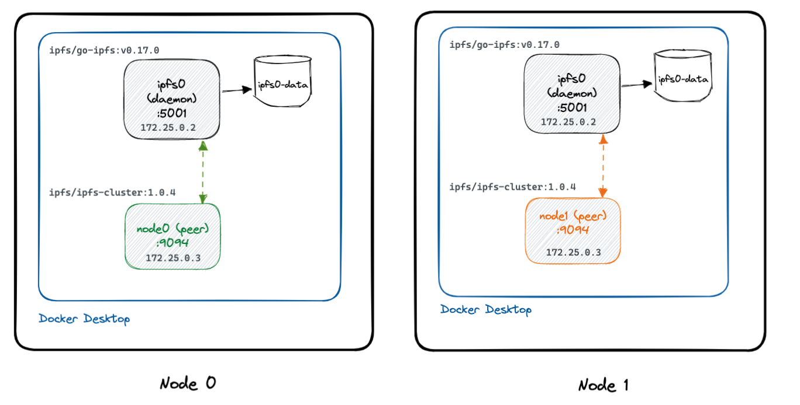

# docker-ipfs-cluster

## Introduction

This repository shows how to set-up a 2-node **private** IPFS cluster with Docker Compose.



An IPFS node is a machine where the IPFS daemon (Kubo) and a cluster peer (for replication) are both running.

To create a **private** IPFS you need a Swarm key. For this example, you can use the one provided in the repo, but it's highly recommended you create your own. You can use [go-ipfs-swarm-key-gen](https://github.com/Kubuxu/go-ipfs-swarm-key-gen) to create one as follows:

```shell
ipfs-swarm-key-gen > swarm.key
```

### Set up `node0`

The node 0 is composed of 2 services:

- `ipfs0` - the IPFS daemon (Kubo) - see [docker-compose.yml](./docker-compose.yml).
- `node0` - the IPFS cluster peer - see [docker-compose.node0.yml](./docker-compose.node0.yml)

To setup the first node of the IPFS cluster, you need to set the `CLUSTER_SECRET` environment variable. You can get this value from the last line of the `swarm.key` file.

```shell
CLUSTER_SECRET=$(tail -1 swarm.key) \
docker compose \
    -f docker-compose.yml \
    -f docker-compose.node0.yml \
    up -d
```

Once both services are up and running, you have to take note of the peer ID (it will be used when setting up `node1` in the next step):

```shell
NODE0_PEER_ID=$(docker exec -it node0 ipfs-cluster-ctl id | cut -d " " -f1 | awk 'NF')
```

### Set up `node1`

The node 1 is composed of 2 services:

- `ipfs0` - the IPFS daemon (Kubo) - see [docker-compose.yml](./docker-compose.yml).
- `node1` - the IPFS cluster peer - see [docker-compose.node1.yml](./docker-compose.node1.yml)

The `docker-compose.node1.yml` is intended to run in a **different host** than `node0`. Therefore, in a different host, clone the repository:

```shell
git clone https://github.com/felipecruz91/docker-ipfs-cluster

cd docker-ipfs-cluster
```

Next, start the `node1` with compose:

```shell
CLUSTER_SECRET=$(tail -1 swarm.key) \
NODE0_IP_ADDRESS=$NODE0_IP_ADDRESS \ # It MUST be reachable by other cluster peers.
NODE0_PEER_ID=$NODE0_PEER_ID \ # This is the value from the previous step.
docker compose \
 -f docker-compose.yml \
 -f docker-compose.node1.yml \
 up -d

```

### Verify the connectivity between the peers

From the host where `node0` is running, execute the following command to list the peers of the IPFS cluster:

```shell
docker exec -it node0 ipfs-cluster-ctl peers ls
```

Output:

```shell
12D3KooWFsmwX4tbG8vgHh726P7Hj5KupYM7a7eoMotkBEPjQUzm | node0 | Sees 1 other peers
  > Addresses:
    - /ip4/100.112.159.22/tcp/9096/p2p/12D3KooWFsmwX4tbG8vgHh726P7Hj5KupYM7a7eoMotkBEPjQUzm
    - /ip4/127.0.0.1/tcp/9096/p2p/12D3KooWFsmwX4tbG8vgHh726P7Hj5KupYM7a7eoMotkBEPjQUzm
    - /ip4/172.25.0.3/tcp/9096/p2p/12D3KooWFsmwX4tbG8vgHh726P7Hj5KupYM7a7eoMotkBEPjQUzm
  > IPFS: 12D3KooWN4FKqoBcnw5x3Z8qXhdo1RRqtNYeui9L6hPbZ1Wke5Qy
    - /ip4/127.0.0.1/tcp/4001/p2p/12D3KooWN4FKqoBcnw5x3Z8qXhdo1RRqtNYeui9L6hPbZ1Wke5Qy
    - /ip4/172.25.0.2/tcp/4001/p2p/12D3KooWN4FKqoBcnw5x3Z8qXhdo1RRqtNYeui9L6hPbZ1Wke5Qy
12D3KooWJ9jjCZto9V4WRe1YMYfG7B7WvmTgbXeStSamdFvCRz1s | node1 | Sees 1 other peers
  > Addresses:
    - /ip4/127.0.0.1/tcp/9096/p2p/12D3KooWJ9jjCZto9V4WRe1YMYfG7B7WvmTgbXeStSamdFvCRz1s
    - /ip4/172.25.0.1/tcp/59854/p2p/12D3KooWJ9jjCZto9V4WRe1YMYfG7B7WvmTgbXeStSamdFvCRz1s
    - /ip4/172.25.0.3/tcp/9096/p2p/12D3KooWJ9jjCZto9V4WRe1YMYfG7B7WvmTgbXeStSamdFvCRz1s
  > IPFS: 12D3KooWLficW1AE161AfMC9wj77qZ2i62qxqdJTi12vdxA1D6gR
    - /ip4/127.0.0.1/tcp/4001/p2p/12D3KooWLficW1AE161AfMC9wj77qZ2i62qxqdJTi12vdxA1D6gR
    - /ip4/172.25.0.2/tcp/4001/p2p/12D3KooWLficW1AE161AfMC9wj77qZ2i62qxqdJTi12vdxA1D6gR
```

Although your output will be slightly different (peer IDs will **not** be the same), if there's connectivy you should see the following lines from the output below:

- `node0 | Sees 1 other peers`
- `node1 | Sees 1 other peers`
